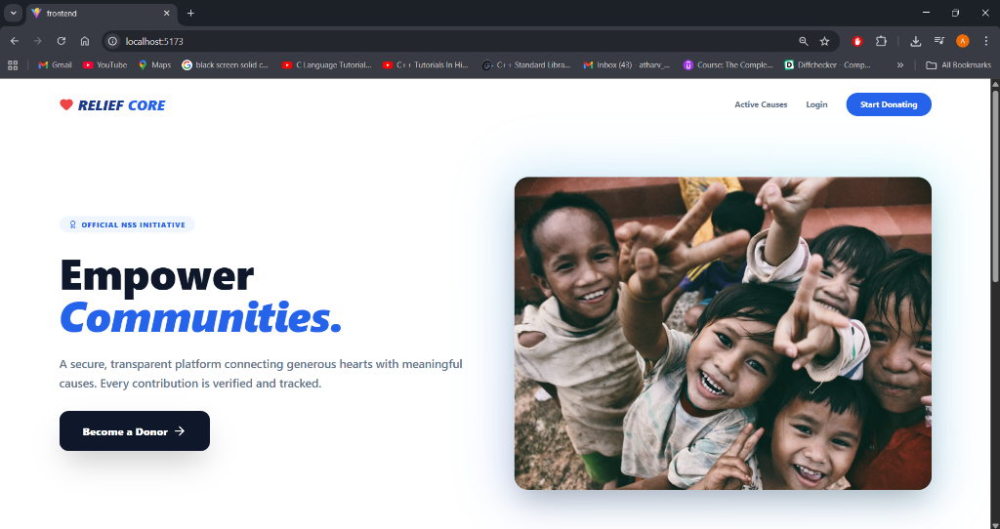
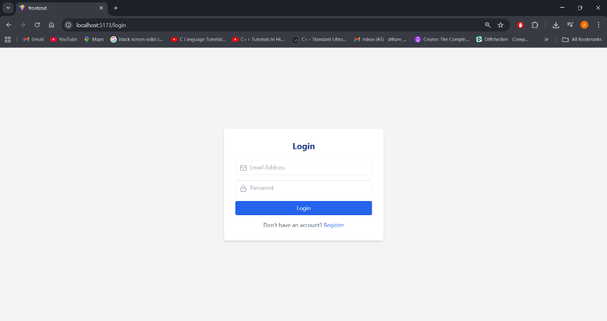
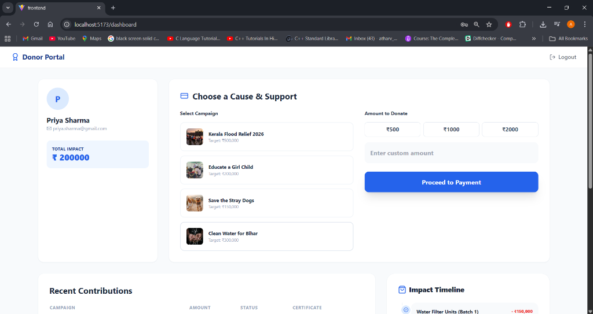
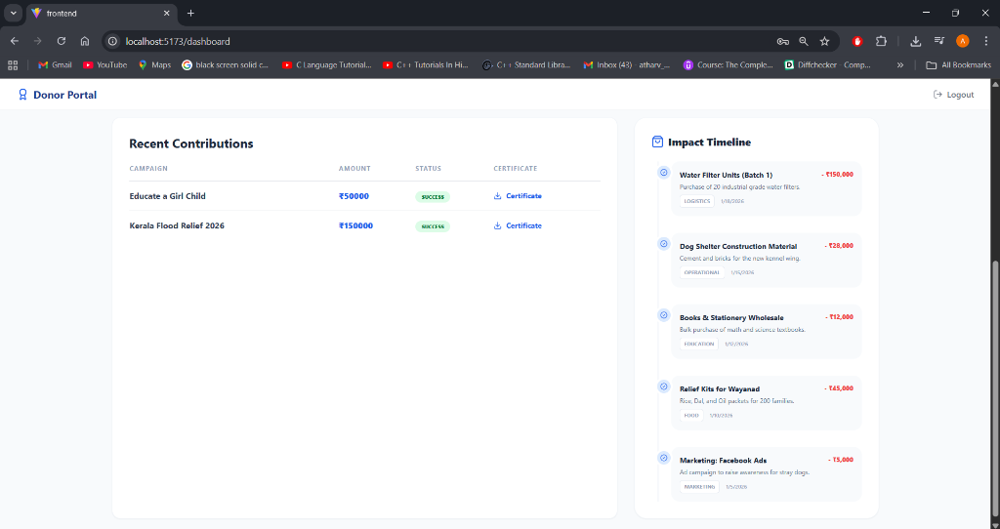
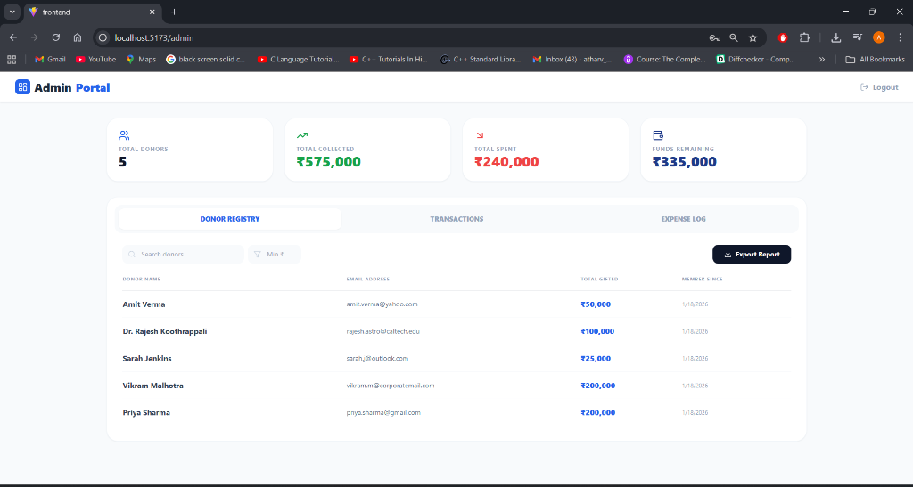
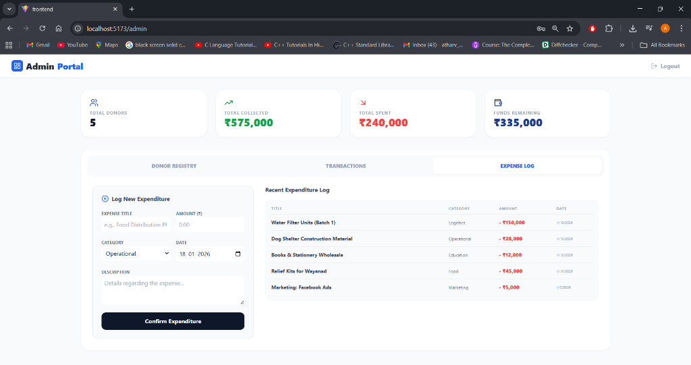
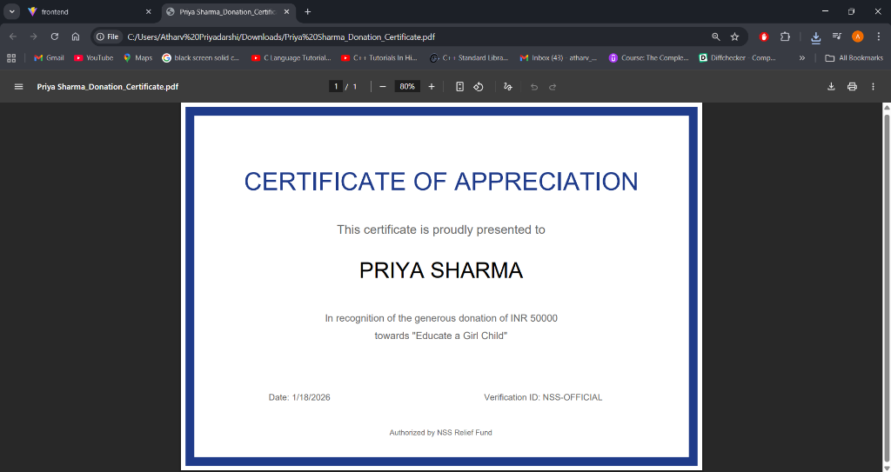

# ReliefCore - Advanced NGO Financial Transparency System

- Chehek Agrawal : 23117012 & Atharv Priyadarshi : 23117034

Welcome to **ReliefCore**, a comprehensive MERN-stack application designed to revolutionize how Non-Governmental Organizations (NGOs) operate and interact with donors. 

Unlike traditional platforms that simply collect money, **ReliefCore** enforces financial integrity through a **"Zero-Deficit" budget guard** and provides donors with a real-time **Impact Timeline**, showing exactly where their contributions are spent.

---

## 📸 Application Tour

### 1. The Public Face
The landing page allows anyone to browse verified causes. It features a premium, responsive design with smooth animations.


### 2. Secure Authentication
Users and Admins access the system via a secure login portal using JWT Authentication.


### 3. User Dashboard (The Donor Experience)
Once logged in, donors can view active campaigns, make quick donations, and track their personal contribution history.


### 4. The Impact Timeline (Financial Transparency)
This is the core feature of ReliefCore. It displays a live feed of the NGO's expenditures. Donors can see tangible proof of work (e.g., procurement of food, medicine) in chronological order.


### 5. Admin Portal (Financial Control)
The Admin Dashboard provides a bird's-eye view of the organization's health. It tracks **"Total Collected" vs. "Total Spent"** and enforces a strict rule: **You cannot spend what you do not have.**


### 6. Expense Logging
Admins use this interface to record expenditures. The backend validates each entry against the available funds before saving it to the database.


### 7. Donation Rewards & Certification
Upon every successful donation, the user receives an instant email confirmation and a downloadable **Certificate of Appreciation**, reinforcing the value of their contribution.


---

## 🚀 Key Features Breakdown

### 🛡️ For Donors (Frontend)
-   **Interactive Dashboard**: A personalized space to manage donations and view history.
-   **Real-Time Impact**: The timeline fetches data directly from the Admin's expense log.
-   **Instant Certificates**: Donations trigger the generation of a personalized PDF certificate of appreciation.
-   **Responsive & Polished**: Built with **Tailwind CSS**, the UI adapts perfectly to mobile phones, tables, and desktops.

### 💼 For Admins (Backend)
-   **Smart Budget Guard**: The Node.js backend calculates the `Total Donations - Total Expenses` before allowing any new expense. If the balance is insufficient, the request is rejected with a 400 error.
-   **Granular Tracking**: Expenses are categorized (Medical, Food, Logistics) for better reporting.
-   **Donor Registry**: A searchable database of all contributors and their lifetime giving.
-   **Export Capabilities**: Data can be exported for external auditing.

---

## 🛠️ Technology Stack

| Component | Technology | Description |
| :--- | :--- | :--- |
| **Frontend** | **React + Vite** | Blazing fast Single Page Application (SPA). |
| **Styling** | **Tailwind CSS** | Utility-first framework for modern, responsive design. |
| **Icons** | **Lucide React** | Clean, consistent SVG icons. |
| **Backend** | **Node.js + Express** | Robust REST API handling business logic. |
| **Database** | **MongoDB + Mongoose** | NoSQL database for flexible data modeling. |
| **Auth** | **JWT** | Stateless, secure JSON Web Token authentication. |
| **Payment** | **Stripe API** | Secure, industry-standard payment processing. |
| **PDFs** | **jsPDF** | Client-side generation of donation certificates. |

---

## ⚙️ How to Run Locally

### Prerequisites
-   Node.js (v14+)
-   MongoDB (Local or Atlas)

### 1. Clone the Repository
```bash
git clone https://github.com/your-username/ngo-fundraiser-system.git
cd ngo-fundraiser-system
```

### 2. Backend Setup
```bash
cd backend
npm install
```
Create a `.env` file in the `backend` folder:
```env
PORT=5000
MONGO_URI=mongodb://localhost:27017/ngo-relief
JWT_SECRET=your_secret_key
STRIPE_SECRET_KEY=your_stripe_test_key
CLIENT_URL=http://localhost:5173
```
Start the server:
```bash
npm run dev
```

### 3. Frontend Setup
Open a new terminal:
```bash
cd frontend
npm install
npm run dev
```
Access the app at `http://localhost:5173`.

### 4. Seed Data (Optional)
To populate the app with realistic demo data (campaigns, users, financial history):
```bash
cd backend
node seedData.js
```

---

